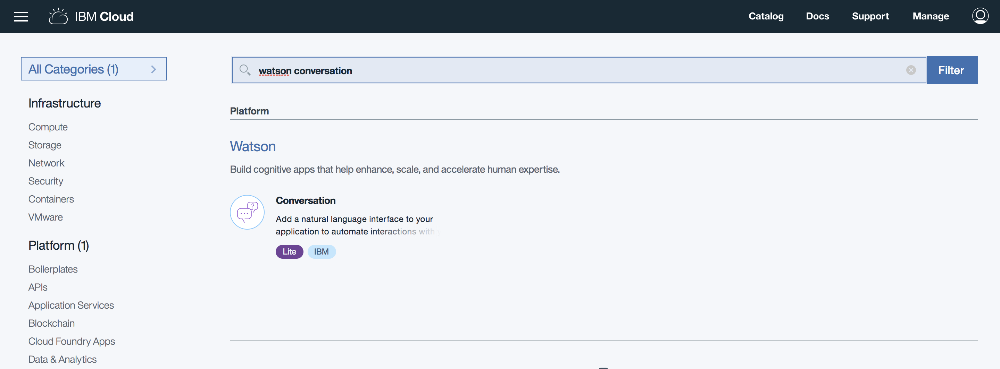
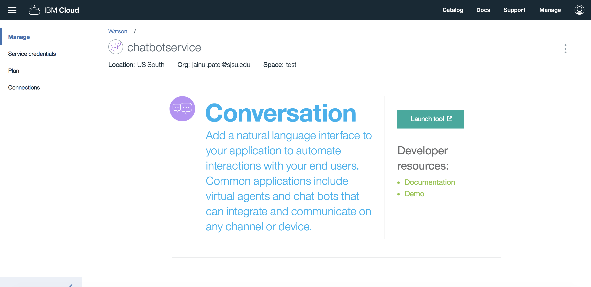
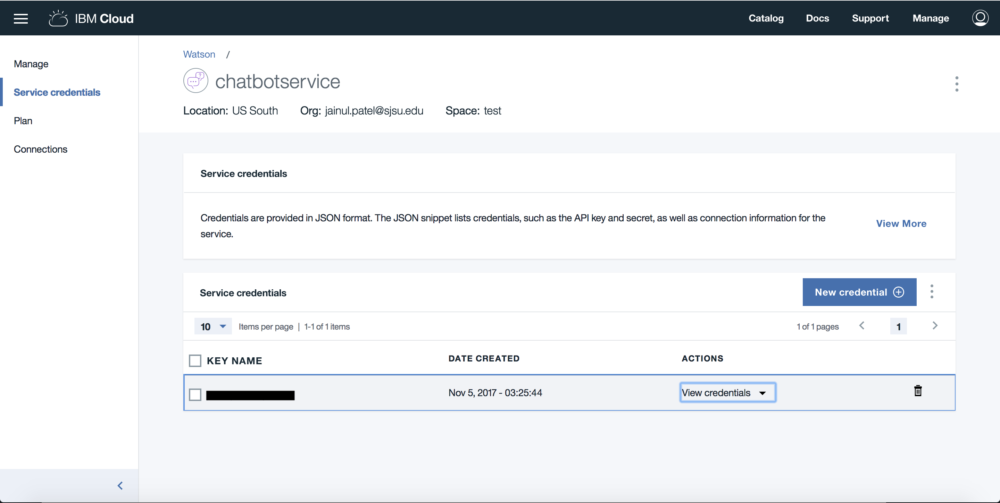
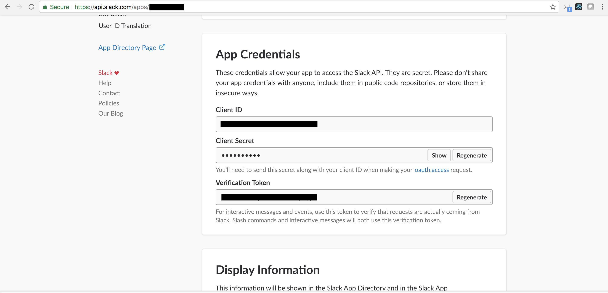

This is ChatME chatbot for SJSU questions
Developed by:
Arpit Mathur
Jainul Patel
Harsha Muktamath

Go to this website for our website https://distinct-cross.glitch.me/

This project contains sample code that shows how to build chatbots for Slack that leverage IBM Watson Conversation and Botkit.

IBM Watson weather API has also been used to find current weather conditions by invoking REST APIs in node.js. Nodes in the dialog are marked as 'action nodes' via context information. The implementation of the actions is done in the Node.js application.

Prerequisites and Setup:

You need three different sets of credentials.

1. Watson Conversation

   Steps to get Watson service credentials:

   1. Log in to Bluemix at https://bluemix.net.
   2. Create an instance of the service:
   3. In the Bluemix Catalog, select the  Watson Conversation service.

    

   4. Type a unique name for the service instance in the Service name field. For example, type my-service-name. Leave the default values for the other options.

   5. Click Create.

   

   6. From the service dashboard, click Service credentials.

   

   7. Click View credentials under Actions.
   8. Copy username and password

2. Weather company data

   To get the credentials follow the steps.

   1. Log in to Bluemix at https://bluemix.net.
   2. Create an instance of the service:
   3. In the Bluemix Catalog, select the  Watson Conversation service.

    

   4. Type a unique name for the service instance in the Service name field. For example, type my-service-name. Leave the default values for the other options.

   5. Click Create.

   6. From the service dashboard, click Service credentials.

   7. Click View credentials under Actions.

   8. Copy username and password

3. Slack App credentials

    1. Sign up with Slack

    2. Create a workspace

    3. From https://api.slack.com/apps create a new app

      

    4. From Basic information tab copy App credentials and paste it to .env file

    

    Now follow the steps given in this youtube video tutorial to deploy your app on glitch
    https://www.youtube.com/watch?v=us2zdf0vRz0&feature=youtu.be

    5. Turn on your Botkit app

    Now that you've got your clientId and clientSecret, you can start your Botkit app. Assuming you are using the Botkit Slack Starter Kit, this can be done by passing the values in via the command line:
      clientId=<my client id> clientSecret=<my client secret> PORT=3000 node .

    6. Configure oauth

    Botkit and Slack use the oauth authentication system to grant bots access to connect to, read from, and send messages to Slack teams.

    Click on the "Oauth & Permissions" tab in your Slack's app setting, and under Redirect URLs, add: https://my-bot-url/oauth, then click save.

    7. Add a Bot User

    Click on the "Bot Users" tab and specify a name for your bot. This is the name that will be used by default when your application creates a new bot on a user's team.

    In addition to a name, enable the option for "Always Show My Bot Online."

    8. Set up Interactive messages

    "Interactive messages" is Slack's fancy way of saying "buttons."

    In order to enable buttons, click on the "Interactive Components" tab and under Request URL, add https://my-bot-url/slack/receive, then click save.

    9. Set up Event Subscriptions

    To start receiving messages, enable event subscriptions. First, under Request URL, add https://my-bot-url/slack/receive. When you finish typing, Slack will verify that this endpoint is properly configured. You must be running your Botkit application, and the application must be accessible at the URL specified for this to work.

    Once verified, click "Add Bot User Event", and using the dropdown that appears, select all of the message.* events: message.channels, message.groups, message.im, message.mpim. This tells Slack to send your bot all messages that are sent in any channel or group in which your bot is present. Add other events as needed.

    Finally, scroll to the top of the page and switch "Enable Events" to "on". Your bot is now ready to receive messages!

    10. Add your bot to your Slack team

    Now that your bot is configured, and your application is up and running, you can login and add your bot. Visit https://my-bot-url/login, and you will be automatically directed to Slack's login page. Login and choose a team. You'll get one more confirmation before being redirected back to your app.

    Meanwhile, your bot should appear inside your Slack team! You should receive a friendly welcome message!
